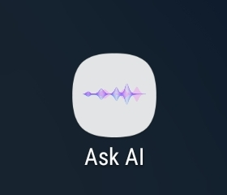

# Ask Ai **🤖**

**Ask-Ai** is a mobile application built with Android Studio and Kotlin that enables speech-to-speech interactions using machine learning. Users provide voice commands that are converted into text, processed by a large language model (LLM), and then returned as speech using text-to-speech technology. The app is designed to enhance accessibility for those who prefer or require voice-based interaction, making it suitable for individuals with disabilities, busy professionals, and anyone in hands-free environments.

## **Table of Contents 📋**

1. [Introduction](#-introduction)  🌐
2. [Features](#-features) ✨
3. [File Descriptions](#-file-descriptions) **📂**
4. [Installation and Setup](#-installation-and-setup) **🔧**
5. [User Manual](#-user-manual)  📚
6. [Contributors](#-contributors) 👨‍💻

## 🌐 Introduction

This project focuses on developing a mobile application that utilizes machine learning to enable speech-to-speech inference using a large language model (LLM). The goal is to create a seamless interaction between users and the LLM through voice communication, without requiring the user to type or read. The app allows users to provide voice commands, which are converted to text via a speech-to-text engine. This text is then processed by the LLM, which generates a relevant response. Finally, the response is converted back into speech using text-to-speech technology, allowing users to hear the answer in real-time.

## ✨ Features

- **Speech-to-Text Integration:** Converts user voice input into text for processing.
- **Large Language Model Processing:** Interprets and generates responses to user commands using an integrated LLM ([Gemini](https://gemini.google.com/app)).

<table align="center">
    <tr>
        <td></td>
    </tr>
</table>

- **Text-to-Speech Integration:** Converts text responses back into audible speech for users using Android’s `TextToSpeech` engine.
- **Kotlin-Powered:** The app is built using Kotlin, a modern language for Android development.
- **Accessible UI:** Designed for users who require hands-free operation and audio-based interaction.

## **📂** File Descriptions

- **`MainActivity.kt`:** The main activity of the application, where user interaction and voice command processing begins.
- **`ModelHelper.kt`:** Helper class for processing text using the large language model (LLM) and generating a suitable response.
- **`SpeechRecognitionHelper.java`:** Java-based helper class for handling speech recognition functionality, converting voice input into text.
- **`TTSHelper.kt`:** Handles text-to-speech conversion, taking the LLM's generated text and reading it out loud to the user.

## **🔧** Installation and Setup

### Requirements

- **Android Studio**: Version 4.0 or above.
- **Kotlin**: Ensure your project is configured to use Kotlin.
- **Internet connection : important for Google Cloud API.**
- **Android device (can be replaced by AVD)**

### Steps

1. **Clone the Repository:**
    
    ```bash
    git clone https://github.com/Amir-Ragaie/Ask-Ai.git
    cd Ask-Ai
    
    ```
    
2. **Open in Android Studio:**
    - Open Android Studio and select "Open an Existing Project."
    - Navigate to the project directory and open it.
3. **Build and Run:**
    - Connect an Android device or launch an emulator (AVD).
    - Build and run the project by selecting `Run > Run 'app'` or clicking the play button in Android Studio.

## 📚 User Manual

Once the app is running, users can:

- Tap the microphone icon to begin speaking.
- The app will convert the voice input into text.
- The LLM processes the text and generates a response.
- The response is read back to the user via text-to-speech, powered by `TTSHelper.kt`.
- you can click on the **stop button** at any time to terminate the response.

<table align="center">
    <tr>
        <td></td>
    </tr>
</table>
<br>

<!-- put 2 images next to each other -->
<table align="center">
    <tr>
        <td></td>
        <td></td>
    </tr>
</table>

## 👨‍💻 Contributors

This project is a collaborative effort by the talented students of CSED26. The team members who contributed to the development and success of this project are:

- [Amir Ragaie](https://github.com/Amir-Ragaie)
- [Abdallah Adel](https://github.com/abdallahadel667)
- [Ali Eldin](Aly-El-Din)